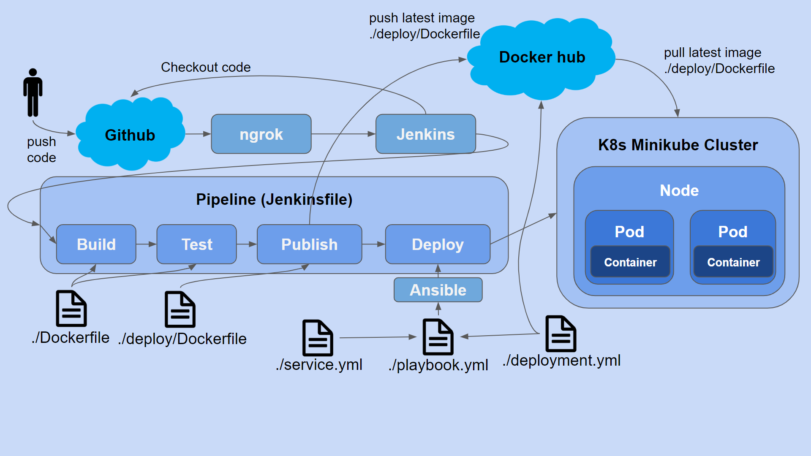

# Repo for CI/CD pipeline Demo using Jenkins, Ansible and K8s

This is a sample project that is used to do the demo on CI/CD pipeline using Jenkins, Ansible and K8s.

## The Architecture of the files used in the demo.

## Pre-requistes for the

* Account on Github
* Account on Docker hub
* Ngrok
* Jenkins
* Docker
* Ansible
* Kubectl
* K8s Minikube
* VirtualBox
* You need to fork this repo if you need to repeat the steps in the demo.
* You will also need to add your own credentials of Github and Docker hub to `Jenkins` under `Credentials`. The Github credentials can have any ID on `jenkins` but you will need to choose in the right way when you create the `Pipeline` item in `Jenkins`. You will also need to change the `credentials-id` called `docker-token` ID in the `Jenkinsfile` to refer to the `credentials-id` of your own Docker hub credentials on `Jenkins`.

## Demo terminal commands
Following are the terminal commands that were used in the demo:

1. Create a K8s cluster by starting `minikube`: `minukube start --driver=virtualbox`
1. Show info with `kubectl`: `kubectl get nodes, kubectl get pods (nothing)`
1. Start Jenkins: in our case, ifthe stand-alone WAR file is downloaded, run `java -jar jenkins.war` fromt the directory that has the `jenkins.war`.
1. Start ngrok: First install ngrok and authenticate yourself following the instructions on ngrok website. Then run: ./ngrok http 8080
1. Add a new `Pipeline` by clicking on `New Item` in `Jenkins` and adding the link to your Github fork repo and following the steps as done in the demo.
1. Click on `Build Now` to trigger building a pipeline for the first time on `Jenkins`.
1. Run `minikube service node-service-example` to make minikube open your default browser and show you that the website is running on K8s node.
1. Change the `versionNumber` variable in the java file `SampleDemoMain.java`. and push to github. This will deploy two pods on the K8s cluster that was created.
1. Run `minikube service node-service-example` to make minikube open your default browser and show you that the website is running on K8s node.
1. Refresh the webpage continuously and note zero down time deployment.
1. You can also show info about the k8s cluster by running `kubectl get nodes` and `kubectl get pods`.
1. Open Docker hub and you will see that two images were created.
